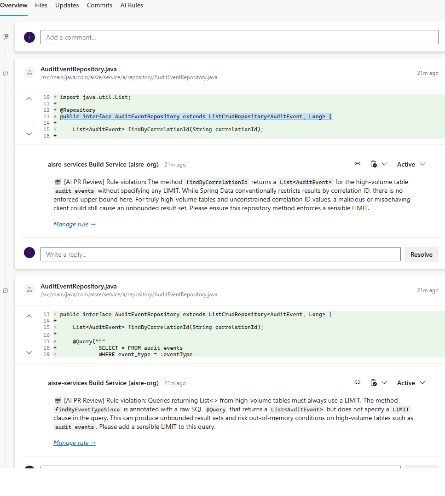
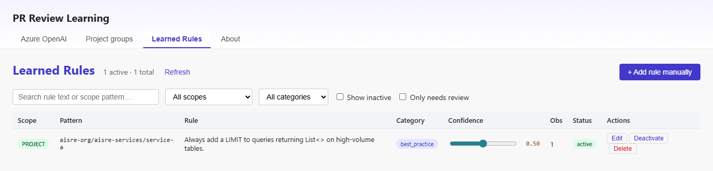

# AI PR Review

> Pull request reviews that learn from your team — not from generic internet advice.

**AI PR Review** is a free Azure DevOps extension that automatically reviews every pull request using patterns your team already established. It reads resolved PR comments from past merges, extracts the rules your reviewers actually enforced, and applies them to every new PR — inline, like a human reviewer.

📦 **Install from Marketplace:** [marketplace.visualstudio.com/items?itemName=AISRE.pr-review](https://marketplace.visualstudio.com/items?itemName=AISRE.pr-review)



---

## How it works

```
  Past PR (merged)              New PR (opened)
  ─────────────────             ─────────────────
  Reviewer: "Always use         PrReviewLearning@1 runs,
  HikariCP here. See our        matches learned rule →
  #best-practice guide."        posts inline comment:
  Dev fixes, merges.            "⚠ Use HikariCP — your
                                team's rule (4 observations)"
        ↓
  ingest task learns rule,
  stores it in your ADO org
```

1. Add `PrReviewLearning@1` (mode: **review**) to your PR validation pipeline — one task, zero config beyond that.
2. Add the same task (mode: **ingest**) to your post-merge pipeline to learn new rules automatically.
3. Configure your Azure OpenAI endpoint once in Project Settings → PR Review.

That's it. No servers to operate, no data leaving your Azure tenant.

---

## Features

- **Inline comments on every PR** — AI findings appear directly on the changed lines
- **Learns from your history** — rules come from your team's own resolved comments, not internet opinions
- **`#best-practice` shortcut** — tag any comment to immediately create a rule, without waiting for the AI to classify it
- **Project groups** — one rule can apply across a set of related repositories (e.g. all payment-service repos)
- **Three review modes** — full AI review, rule-based only, or disabled — choose per pipeline
- **Your data, your tenant** — BYOK Azure OpenAI, storage in ADO Extension Data Service, zero external dependencies
- **Free** — you pay only for your own Azure OpenAI token usage (~$5–50 / month typical)



---

## Requirements

| Requirement | Notes |
|---|---|
| Azure DevOps organization | Cloud or on-prem |
| Azure OpenAI resource | Chat model (`gpt-4o-mini` recommended) + embedding model (`text-embedding-3-small`) |
| Azure Pipelines | For the pipeline task |

---

## Installation

1. Install the extension from the [Visual Studio Marketplace](https://marketplace.visualstudio.com/items?itemName=AISRE.pr-review) *(link active after public release)*.
2. Open **Project Settings → PR Review** and enter your Azure OpenAI endpoint and API key.
3. Add the tasks to your pipelines (see below).

---

## Pipeline setup

### PR validation pipeline (review mode)

```yaml
trigger: none

pr:
  branches:
    include: [main, develop]

jobs:
  - job: AIReview
    pool:
      vmImage: ubuntu-latest
    steps:
      - task: PrReviewLearning@1
        inputs:
          mode: review
          reviewMode: full       # full | rules-only | disabled
          maxComments: '20'
          minConfidence: '0.5'
          dryRun: false
```

### Post-merge pipeline (ingest mode — learns new rules)

```yaml
trigger:
  branches:
    include: [main]

jobs:
  - job: IngestRules
    pool:
      vmImage: ubuntu-latest
    steps:
      - task: PrReviewLearning@1
        inputs:
          mode: ingest
```

### Both in one pipeline (recommended for simplicity)

```yaml
- task: PrReviewLearning@1
  inputs:
    mode: review
  condition: eq(variables['Build.Reason'], 'PullRequest')

- task: PrReviewLearning@1
  inputs:
    mode: ingest
  condition: ne(variables['Build.Reason'], 'PullRequest')
```

---

## Task inputs

| Input | Default | Description |
|---|---|---|
| `mode` | — | **Required.** `review` — review a new PR. `ingest` — learn rules from a merged PR. |
| `reviewMode` | `full` | `full` — AI general + rules. `rules-only` — matched rules only (cheaper). `disabled` — skip review. |
| `maxComments` | `20` | Hard cap on comments posted per run. |
| `minConfidence` | `0.5` | Rules below this threshold are ignored. |
| `dryRun` | `false` | Log findings to build output instead of posting to the PR. |

---

## The `#best-practice` tag

If a reviewer writes a comment containing `#best-practice`, the ingest task classifies it as **immediately addressable** — no AI resolution analysis needed. The rule is extracted directly from the comment text and stored with full confidence. This is the fastest path from "we agreed on something in a PR" to "it's automatically enforced on the next PR".

---

## Privacy & security

| What | Where it goes |
|---|---|
| Source code / diffs | Your Azure tenant only |
| PR comments | Your Azure tenant only |
| Azure OpenAI API key | Encrypted in Extension Data Service (your org) |
| AI prompts & responses | Between your pipeline agent and your Azure OpenAI resource |

**AISRE Labs never sees your code, your diffs, or your PR comments.** The pipeline task runs as a standard Azure Pipelines job authenticated by `$(System.AccessToken)`. All network calls go to `dev.azure.com/{your-org}/…` and `{your-resource}.openai.azure.com/…`.

Full details: [aisre-labs.github.io/pr-review/privacy](https://aisre-labs.github.io/pr-review/privacy)

---

## Cost

| Item | Who pays | Typical cost |
|---|---|---|
| Extension | — | **Free** |
| Extension Data Service (rule storage) | — | **Free** (built into ADO) |
| Pipeline minutes | You | Covered by ADO free tier for most orgs |
| Azure OpenAI tokens | You | $5–50 / month for ~100 PRs/month (`gpt-4o-mini`) |

---

## Support & feedback

- **Bug reports / feature requests:** [GitHub Issues](https://github.com/aisre-labs/pr-review/issues)
- **Security vulnerabilities:** privacy@aisre-labs.dev (do not open a public issue)

---

## License

Proprietary — see [LICENSE](https://github.com/aisre-labs/pr-review/blob/main/LICENSE).  
AI prompt templates are trade secrets of AISRE Labs. Reverse engineering is prohibited.
